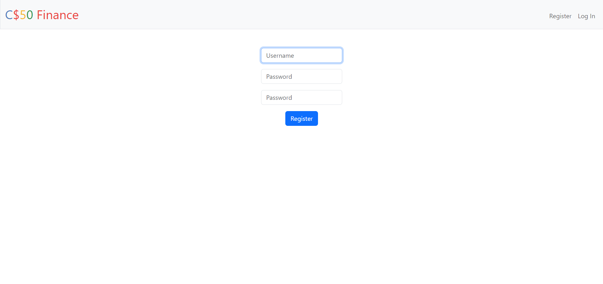
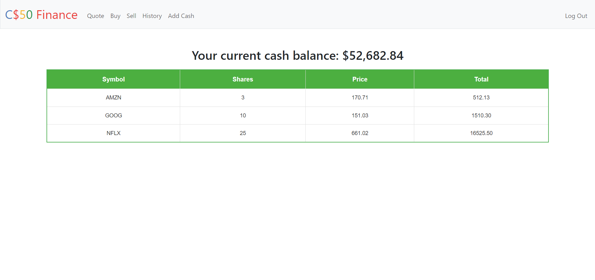
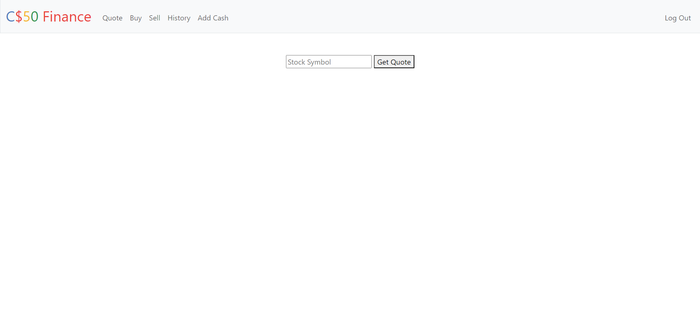
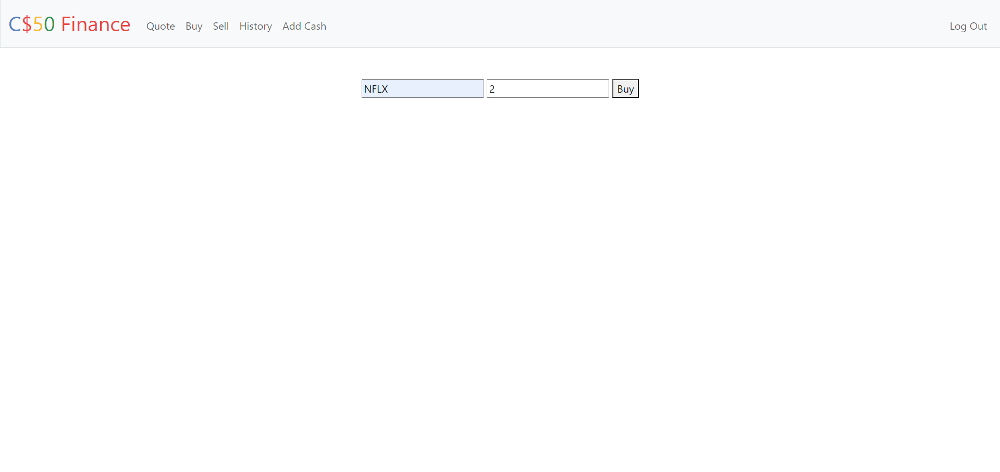
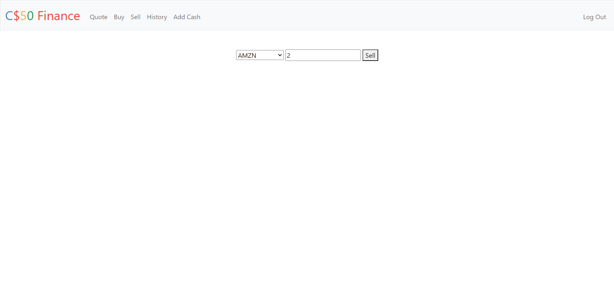
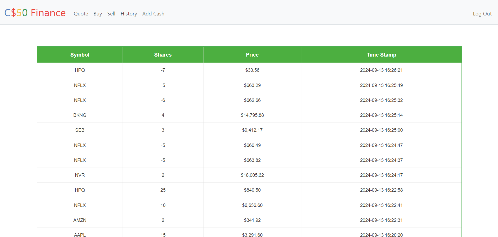
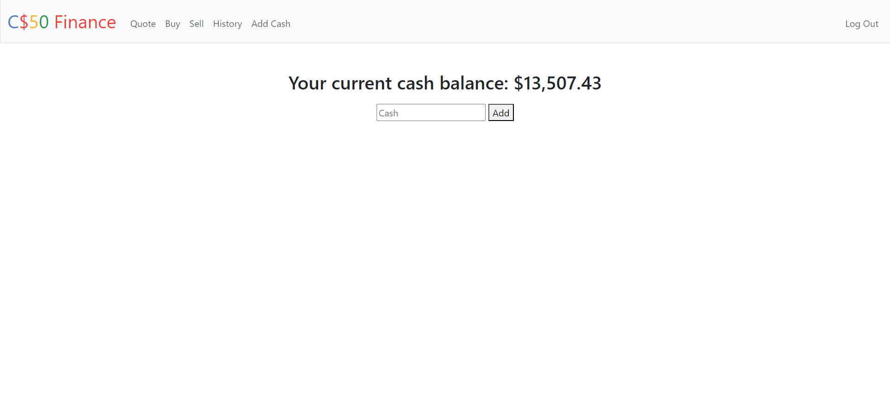

# StockTradingApp

A simple web site where you can buy and sell stocks.

## Table of Contents
- [Description](#description)
- [Installation](#installation)
- [Usage](#usage)
- [Technologies Used](#Technologies-Used)
- [Contact](#contact)
- [Acknowledgments](#acknowledgments)
- [License](#license)


## Description

### Register - Log In

You can register as a new user and then log in with your username and password.
### Index

Once logged in, you will be redirected to the index page where you can view your shares and current cash balance.
### Quote

Search for different companies' stocks and view their current prices.
### Buy Page

Buy shares by entering stock symbols and specifying the number of shares you want to purchase.
### Sell

Sell shares you own by selecting stocks and entering the number of shares you want to sell.
### History

View your transaction history, including past buys and sells.
### Add Cash

Add funds to your account by entering the amount you wish to deposit. This will increase your cash balance, allowing you to buy more shares.
### Log Out
Log out of your account to end your session. This will securely close your current login and return you to the login page.

## Installation

1. Clone the repository: `git clone https://github.com/SalihToker/StockTradingApp.git`
2. Navigate to the project directory: `cd StockTradingApp`
3. Install dependencies: `pip install -r requirements.txt`

## Usage

To start the project, run:

```bash
flask run
```
Open your web browser and go to http://127.0.0.1:5000 to view the application

## Technologies Used

### Frontend:
- HTML
- CSS
- Bootstrap

### Backend:
- Python
  - Flask (web framework)
  - Jinja (templating engine)
  - Werkzeug (WSGI utility library, used for password hashing)

### Database:
- SQLite

## Contact
If you have any questions, please open an issue on GitHub.

## Acknowledgments
Cs50 - This project is a part of CS50 Harvard’s course and includes materials from the course. See the course (https://cs50.harvard.edu) for more details.

## License
This project is licensed under the MIT License


